# 🏗️ Complete Workflow Analysis: Design Parameters → Building Code Checklist & 2D Layout

## 📊 **Core System Architecture - 4 Key Tables**

Based on research of your existing system, here are the **4 critical tables** that drive the entire workflow:

### **Table 1: `user_inputs` / `design_requirements`** 
**Purpose**: Capture initial design parameters
```sql
CREATE TABLE design_requirements (
    id INTEGER PRIMARY KEY AUTOINCREMENT,
    project_name TEXT NOT NULL,
    building_type TEXT NOT NULL,           -- 'office', 'school', 'retail'
    jurisdiction TEXT NOT NULL,            -- 'NBC', 'Alberta', 'Ontario', 'BC'
    occupancy_load INTEGER NOT NULL,       -- Number of users
    space_dimensions TEXT,                 -- JSON: {"length": 10, "width": 8, "height": 3}
    accessibility_level TEXT DEFAULT 'basic', -- 'basic', 'enhanced', 'universal'
    special_requirements TEXT,             -- JSON: ["family_facilities", "baby_changing"]
    created_at TIMESTAMP DEFAULT CURRENT_TIMESTAMP
);
```

### **Table 2: `building_code_rules`**
**Purpose**: Store programmable building code logic
```sql
CREATE TABLE building_code_rules (
    id INTEGER PRIMARY KEY AUTOINCREMENT,
    rule_id TEXT UNIQUE NOT NULL,          -- 'NBC_3.7.2_TOILET_COUNT_OFFICE'
    rule_type TEXT NOT NULL,               -- 'fixture_count', 'clearance', 'accessibility'
    jurisdiction TEXT NOT NULL,            -- 'NBC', 'Alberta', 'Ontario'
    building_type TEXT,                    -- 'office', 'school', 'retail'
    condition_logic TEXT,                  -- JSON: When rule applies
    requirement_logic TEXT,               -- JSON: What rule calculates
    code_reference TEXT,                  -- 'NBC 3.7.2'
    priority INTEGER DEFAULT 50
);
```

### **Table 3: `compliance_checklist`**
**Purpose**: Store generated compliance checklist items
```sql
CREATE TABLE compliance_checklist (
    id INTEGER PRIMARY KEY AUTOINCREMENT,
    design_requirement_id INTEGER NOT NULL,
    checklist_item TEXT NOT NULL,
    item_category TEXT,                    -- 'fixture_count', 'accessibility', 'clearance'
    requirement_description TEXT,
    code_reference TEXT,
    status TEXT DEFAULT 'pending',         -- 'pending', 'compliant', 'non_compliant'
    measured_value TEXT,                   -- Actual measurement
    required_value TEXT,                   -- Required measurement
    FOREIGN KEY (design_requirement_id) REFERENCES design_requirements(id)
);
```

### **Table 4: `generated_layouts`**
**Purpose**: Store 2D layout results with coordinates
```sql
CREATE TABLE generated_layouts (
    id INTEGER PRIMARY KEY AUTOINCREMENT,
    design_requirement_id INTEGER NOT NULL,
    layout_name TEXT,
    function_package_placements TEXT,      -- JSON: positioned components with coordinates
    total_area_used REAL,
    efficiency_score REAL,                -- 0-100 space efficiency
    compliance_score REAL,                -- 0-100 code compliance
    accessibility_score REAL,             -- 0-100 accessibility
    layout_notes TEXT,
    FOREIGN KEY (design_requirement_id) REFERENCES design_requirements(id)
);
```

---

## 🔄 **COMPLETE WORKFLOW: Step-by-Step Process**

### **STEP 1: User Input Collection** 
**Frontend Form → `design_requirements` Table**

```mermaid
graph TD
    A[User Opens Design Form] --> B[Enter Project Details]
    B --> C[Building Type: office/school/retail]
    C --> D[Occupancy Load: Number of users]
    D --> E[Room Dimensions: L×W×H]
    E --> F[Jurisdiction: NBC/Alberta/Ontario]
    F --> G[Accessibility Level: basic/enhanced]
    G --> H[Special Requirements: Array]
    H --> I[Submit Form]
    I --> J[Validate Input Data]
    J --> K[Store in design_requirements Table]
    K --> L[Return requirement_id]
```



**Sample Input Data:**
```json
{
  "project_name": "Office Building A - Main Floor Washroom",
  "building_type": "office",
  "jurisdiction": "NBC",
  "occupancy_load": 150,
  "space_dimensions": {
    "length": 12.0,
    "width": 8.0, 
    "height": 3.0
  },
  "accessibility_level": "enhanced",
  "special_requirements": ["family_facilities", "baby_changing"]
}
```

---

### **STEP 2: Building Code Rule Selection**
**`design_requirements` → Query `building_code_rules`**


**Sample Rule Selection:**
```sql
SELECT * FROM building_code_rules 
WHERE jurisdiction = 'NBC' 
  AND (building_type = 'office' OR building_type IS NULL)
  AND rule_type IN ('fixture_count', 'clearance', 'accessibility')
ORDER BY priority DESC;
```

**Selected Rules Example:**
```json
[
  {
    "rule_id": "NBC_3.7.2_TOILET_COUNT_OFFICE",
    "rule_type": "fixture_count",
    "condition_logic": {"building_type": "office", "occupancy": ">1"},
    "requirement_logic": {
      "male_toilets": "CEIL(male_occupancy / 75)",
      "female_toilets": "CEIL(female_occupancy / 40)"
    },
    "code_reference": "NBC 3.7.2"
  },
  {
    "rule_id": "NBC_3.8.3_ACCESSIBLE_COUNT",
    "rule_type": "accessibility",
    "requirement_logic": {
      "accessible_toilets": "MAX(1, CEIL(total_toilets * 0.05))"
    }
  }
]
```

---

### **STEP 3: Fixture Requirements Calculation**
**Apply Mathematical Formulas from Rules**

```mermaid
graph TD
    A[Get Selected Rules] --> B[Calculate Gender Distribution]
    B --> C[Male: 150 × 0.5 = 75 users]
    C --> D[Female: 150 × 0.5 = 75 users]
    D --> E[Apply NBC_3.7.2 Formula]
    E --> F[Male Toilets: CEIL(75/75) = 1]
    F --> G[Female Toilets: CEIL(75/40) = 2]
    G --> H[Total Toilets: 1 + 2 = 3]
    H --> I[Apply Accessibility Rule]
    I --> J[Accessible: MAX(1, CEIL(3×0.05)) = 1]
    J --> K[Calculate Additional Fixtures]
    K --> L[Urinals, Sinks, etc.]
    L --> M[Return Complete Fixture Requirements]
```

**Calculated Requirements:**
```json
{
  "fixture_requirements": {
    "male_water_closets": 1,
    "female_water_closets": 2,
    "urinals": 1,
    "lavatories": 2,
    "accessible_stalls": 1,
    "total_fixtures": 6
  },
  "applied_rules": [
    {
      "rule_id": "NBC_3.7.2_TOILET_COUNT_OFFICE",
      "calculation": "Male: CEIL(75/75)=1, Female: CEIL(75/40)=2",
      "code_reference": "NBC 3.7.2"
    }
  ]
}
```

---

### **STEP 4: Compliance Checklist Generation**
**Rules + Requirements → `compliance_checklist` Table**


**Generated Checklist Items:**
```json
{
  "checklist_sections": [
    {
      "category": "fixture_count",
      "items": [
        {
          "item": "Verify minimum male water closets",
          "requirement": "Minimum 1 male water closet required",
          "code_reference": "NBC 3.7.2",
          "required_value": "1",
          "status": "pending",
          "priority": "critical"
        },
        {
          "item": "Verify minimum female water closets", 
          "requirement": "Minimum 2 female water closets required",
          "code_reference": "NBC 3.7.2",
          "required_value": "2",
          "status": "pending",
          "priority": "critical"
        }
      ]
    },
    {
      "category": "accessibility",
      "items": [
        {
          "item": "Accessible stall clearance",
          "requirement": "1500mm × 1500mm clear floor space",
          "code_reference": "NBC 3.8.3.12",
          "required_value": "1500mm × 1500mm",
          "status": "pending",
          "priority": "critical"
        }
      ]
    }
  ]
}
```

---

### **STEP 5: 2D Layout Generation**
**Requirements + Space Constraints → `generated_layouts` Table**

```mermaid
graph TD
    A[Get Fixture Requirements] --> B[Get Room Dimensions: 12×8×3m]
    B --> C[Select Function Packages]
    C --> D[Male Toilet Stall Package]
    D --> E[Female Toilet Stall Package × 2]
    E --> F[Accessible Stall Package]
    F --> G[Sink Unit Package × 2]
    G --> H[Calculate Space Allocation]
    H --> I[Apply Spatial Layout Algorithm]
    I --> J[Position Components with Coordinates]
    J --> K[Verify Clearances]
    K --> L[Check Accessibility Paths]
    L --> M[Calculate Efficiency Scores]
    M --> N[Store in generated_layouts Table]
```



**Layout Generation Process:**
```python
def generate_2d_layout(fixture_requirements, room_dimensions):
    # 1. Select function packages
    packages = select_function_packages(fixture_requirements)
    
    # 2. Calculate space allocation
    total_area = room_dimensions['length'] * room_dimensions['width']
    package_area = sum(pkg['area'] for pkg in packages)
    circulation_area = total_area * 0.3  # 30% for circulation
    
    # 3. Position packages with coordinates
    positioned_packages = []
    x_pos, y_pos = 1.0, 1.0  # Start position
    
    for package in packages:
        position = {
            "x": x_pos,
            "y": y_pos,
            "width": package['width'],
            "height": package['height'],
            "clearances": package['clearances']
        }
        positioned_packages.append({
            "package_id": package['id'],
            "name": package['name'],
            "position": position
        })
        
        # Update position for next package
        x_pos += package['width'] + package['clearances']['side']
    
    return positioned_packages
```

**Generated Layout Data:**
```json
{
  "layout_id": 12345,
  "layout_name": "Office Building A - Generated Layout v1",
  "room_dimensions": {"length": 12.0, "width": 8.0, "height": 3.0},
  "positioned_packages": [
    {
      "package_id": "male_toilet_stall_01",
      "name": "Standard Male Toilet Stall",
      "position": {"x": 1.0, "y": 1.0, "width": 1.2, "height": 1.8},
      "clearances": {"front": 0.6, "sides": 0.15}
    },
    {
      "package_id": "female_toilet_stall_01", 
      "name": "Standard Female Toilet Stall",
      "position": {"x": 3.0, "y": 1.0, "width": 1.2, "height": 1.8},
      "clearances": {"front": 0.6, "sides": 0.15}
    },
    {
      "package_id": "accessible_stall_01",
      "name": "Accessible Toilet Stall",
      "position": {"x": 1.0, "y": 4.0, "width": 2.0, "height": 2.2},
      "clearances": {"front": 1.5, "transfer_space": 0.9}
    }
  ],
  "efficiency_metrics": {
    "space_utilization": 78.5,
    "compliance_score": 94.2,
    "accessibility_score": 96.8
  }
}
```

---

### **STEP 6: Final Output Generation**
**Downloadable Checklist + 2D Layout Export**


**Final Downloadable Outputs:**

1. **Building Code Compliance Checklist (TXT/PDF)**
```text
BUILDING CODE COMPLIANCE CHECKLIST
=====================================
Project: Office Building A - Main Floor Washroom
Building Type: Office
Jurisdiction: NBC 2020
Occupancy: 150 people
Dimensions: 12.0m × 8.0m × 3.0m

FIXTURE COUNT REQUIREMENTS:
☐ [CRITICAL] Male Water Closets: 1 required (NBC 3.7.2)
☐ [CRITICAL] Female Water Closets: 2 required (NBC 3.7.2)  
☐ [CRITICAL] Accessible Stalls: 1 required (NBC 3.8.3.12)
☐ [HIGH] Urinals: 1 recommended (NBC 3.7.2)
☐ [HIGH] Lavatories: 2 required (NBC 3.7.3)

ACCESSIBILITY REQUIREMENTS:
☐ [CRITICAL] Accessible route width: 1200mm min (NBC 3.8.2)
☐ [CRITICAL] Clear floor space: 1500×1500mm (NBC 3.8.3.12)
☐ [HIGH] Door maneuvering clearance: 600mm (NBC 3.8.3.7)

CLEARANCE REQUIREMENTS:
☐ [MEDIUM] Toilet stall door swing: 760mm (NBC 3.3.1)
☐ [MEDIUM] Corridor width: 1200mm min (NBC 3.3.1)
```

2. **2D Layout Drawing (SVG/DXF)**
- Scaled technical drawing with dimensions
- Component positions and clearances
- Accessibility paths marked
- Code compliance annotations

3. **Compliance Report (PDF)**
- Executive summary
- Detailed compliance analysis
- Recommendations for improvements
- Professional certification ready

---

## 🔄 **Real-Time Workflow Integration**

### **Current Consolidata System Integration:**
Your existing Consolidata system already implements parts of this workflow:

1. **✅ Frontend Form**: `frontend/index.html` captures user input
2. **✅ API Endpoints**: `backend/app.py` has `/api/complete-analysis`
3. **✅ Basic Database**: SQLite with building codes data
4. **✅ Checklist Generation**: Basic compliance checking

### **Missing Components for Complete Workflow:**
1. **Enhanced Logic Rules**: Need comprehensive JSON logic in `building_code_rules`
2. **Layout Generation**: Need spatial positioning algorithm
3. **Export Functions**: Need PDF/DXF export capabilities
4. **Real-time Updates**: Need dynamic checklist updates

---

## 🎯 **Implementation Roadmap**

### **Phase 1: Complete the 4 Core Tables** (1-2 weeks)
1. Enhance `building_code_rules` with comprehensive JSON logic
2. Populate with complete NBC/Alberta/Ontario rules
3. Create `compliance_checklist` table structure
4. Create `generated_layouts` table structure

### **Phase 2: Implement Workflow Logic** (2-3 weeks)
1. Build rule selection and calculation engine
2. Implement checklist generation logic
3. Create 2D layout positioning algorithm
4. Add compliance verification functions

### **Phase 3: Export and Integration** (1-2 weeks)
1. Add PDF/TXT export for checklists
2. Create 2D layout SVG/DXF export
3. Integrate with existing Consolidata frontend
4. Add real-time updates and validation

**Total Implementation Time: 4-7 weeks for complete system**

---

## 🚀 **Next Steps**

1. **Which component should we implement first?**
   - Enhanced building code rules table?
   - Compliance checklist generation?
   - 2D layout positioning algorithm?

2. **What's your priority for MVP?**
   - Basic checklist generation?
   - Simple 2D layout with coordinates?
   - Full export functionality?

3. **Integration approach:**
   - Enhance existing Consolidata system?
   - Build separate modules?
   - Create new unified system?

Your current Consolidata system provides an excellent foundation - we just need to complete the missing workflow components to achieve the full design parameters → checklist + 2D layout pipeline! 🏗️✨ 